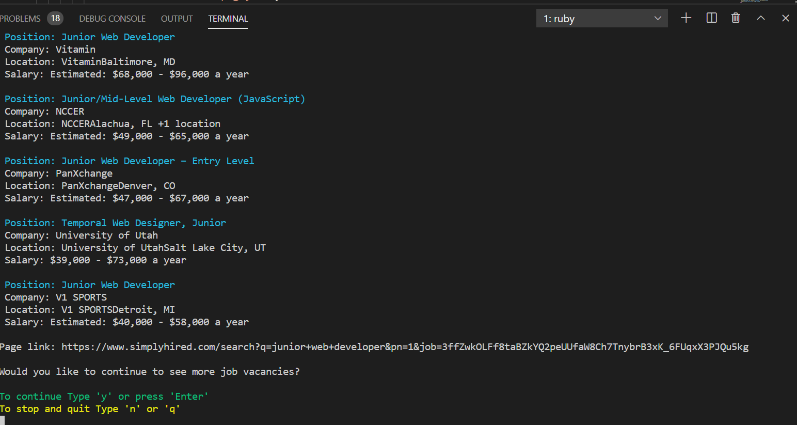

# A Web Scraper

## Definition of Web Scraping
Web scraping is the process of using bots to extract content and data from a website. It extracts underlying HTML code and, with it, data stored in a database. The scraper can then replicate entire website content elsewhere.
It is also a form of copying, in which specific data is gathered and copied from the web, typically into a central local database or spreadsheet, for later retrieval or analysis

## About the project
The purpose of this project is to develop a scraper tool to achieve web-scrapping. This was achieved using Ruby, Open-uri and Nokogiri gem.

Open uri is used to fetch data from the website url. This data is raw and unparsed thus cannot be understood by ruby

Nokogiri is an HTML, XML, SAX, and Reader parser. The raw data is parsed using Nokogiri thus easy to extract data.

## Project Description

In this project I scraped data from [simplyHired.com](https://www.simplyhired.com/search?q=junior+web+developer&job=IlFPuAnY1x4QykmoQBX-48Fp5mhGC2PfhCH2-d6si32qgmQkI-k5Bw). This website is mostly used to search for junior developers roles in various companies. After fetching the data, i filtered it according to Postion,Salary,Location and Company name. The total number of pages is displayed as well as the jobs in total.

## Built With

- Ruby
- Nokogiri
- Open-uri

## Prerequisites

- Latest Ruby version
- Git
- Gems
   - Nokogiri
   - open-uri)
- Text Editor(eg VS Code)

## Getting Started
  1. Clone the repository
- `git clone https://github.com/ZawadiSumba66/ruby-capstone-scraper.git`

2. Change directory
- `cd RUBY-CAPSTONE-SCRAPER`

4. Install open-uri and nokogiri gems by running
- `bundle install`

3. Run the program
- `ruby bin/main.rb`

## Instructions for users
 When you run the file in the terminal. The process of scraping data will start with a welcome message.

 
 
 Then the first page of the website will be shown with all the job vacancies available. 
 
 

 If you feel like continuing to the next page you will need to give a value 'y' otherwise 'n' to stop the process 
 
 You can test the program by running
 
 `- rspec .\spec\start_search_spec.rb` and `.\spec\start_scraper.rb`
 
## Author

👤 **Rose Sumba**

- GitHub: [@ZawadiSumba66](https://github.com/ZawadiSumba66)
- Twitter: [@zawadirose1](https://twitter.com/zawadirose1)
- LinkedIn: [rose-sumba](https://www.linkedin.com/in/rosesumba/)

## 🤝 Contributing

Contributions, issues, and feature requests are welcome!

## Show your support

Give a ⭐️ if you like this project!

## Acknowledgments

- Hat tip to  [simplyHired.com](https://www.simplyhired.com/search?q=junior+web+developer&job=IlFPuAnY1x4QykmoQBX-48Fp5mhGC2PfhCH2-d6si32qgmQkI-k5Bw) for their awesome website
- Hat tip to Microverse for their `README` template.

## 📝MIT License

Copyright 2020 Rose Sumba

Permission is hereby granted, free of charge, to any person obtaining a copy of this software and associated documentation files (the "Software"), to deal in the Software without restriction, including without limitation the rights to use, copy, modify, merge, publish, distribute, sublicense, and/or sell copies of the Software, and to permit persons to whom the Software is furnished to do so, subject to the following conditions:

The above copyright notice and this permission notice shall be included in all copies or substantial portions of the Software.

THE SOFTWARE IS PROVIDED "AS IS", WITHOUT WARRANTY OF ANY KIND, EXPRESS OR IMPLIED, INCLUDING BUT NOT LIMITED TO THE WARRANTIES OF MERCHANTABILITY, FITNESS FOR A PARTICULAR PURPOSE AND NONINFRINGEMENT. IN NO EVENT SHALL THE AUTHORS OR COPYRIGHT HOLDERS BE LIABLE FOR ANY CLAIM, DAMAGES OR OTHER LIABILITY, WHETHER IN AN ACTION OF CONTRACT, TORT OR OTHERWISE, ARISING FROM, OUT OF OR IN CONNECTION WITH THE SOFTWARE OR THE USE OR OTHER DEALINGS IN THE SOFTWARE.
